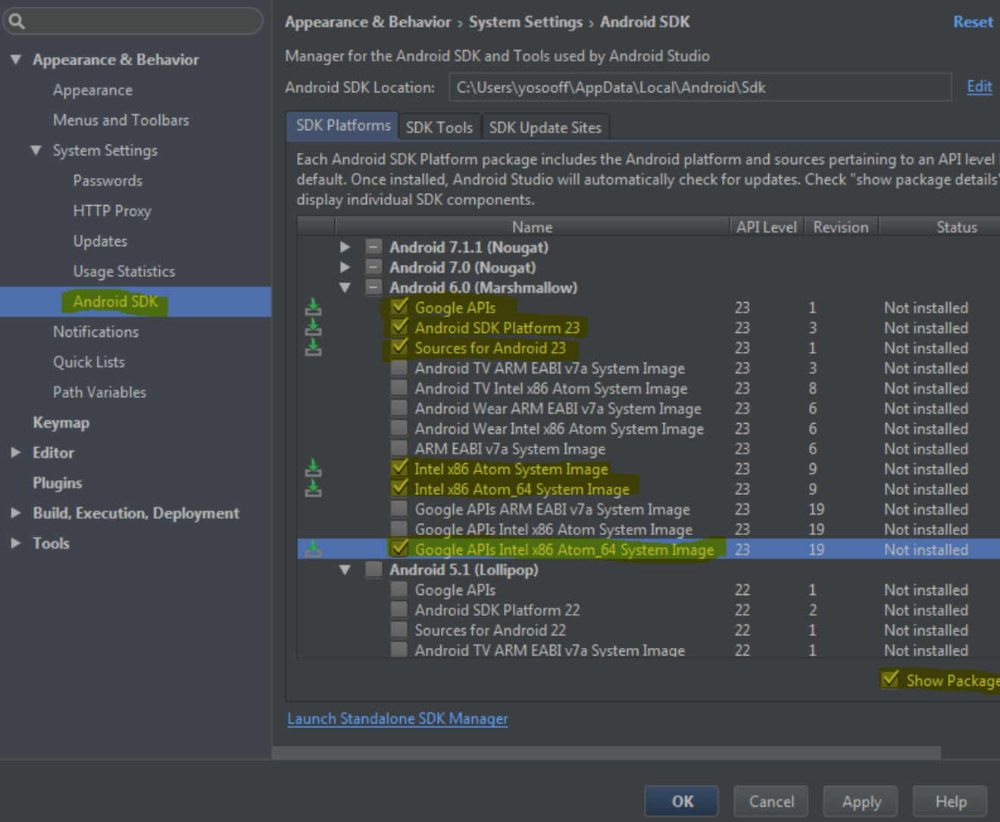

# INSTALLING

**React Native** geliştirmesi için `Macos`, `Windows` ortamlarında aşşağıdaki kurulum işlemlerini takip ediniz.

Gerekli Ortak Yüklemeler

* [Nodejs](https://nodejs.org/en/download/) `LTS` olan yüklenmelidir.
* [Android Studio](https://developer.android.com/studio/) `DOWNLOAD ANDROID STUDIO` butonuna tıklandıktan sonra indirebilirsiniz.
* [Java](https://www.oracle.com/technetwork/java/javase/downloads/jdk8-downloads-2133151.html) ` Java SE Development Kit 8u221` olanı indirmeniz gerekiyor.

**NOT**: `Nodejs` dosya olarak yüklendiğinde `Npm` otomatik olarak yüklenmektedir!

## Macos

## Windows

#### Nodejs
Nodejs kurulumunu yukarıdaki linkten indirebilir ve kurabilirsiniz. Npm otomatik olarak kurulu gelecektir.

#### Android Studio
Aynı şekilde yukarıdaki linkten indirelim. Kuruluma geçelim.

1) Kurulumu yaparken bir seçim ekranı gelecek, burada “Custom Installation” seçeneğini seçelim.

**Android SDK nin nereye yükleneceği bilgisini Android SDK Location kısmından kopyalayalım!**

2) Aşşağıdakilerini **SDK Components Setup** ekranından yükleyin.

* Android SDK
* Android SDK Platform
* Performance (Intel HAXM)
* Android Virtual Device

3) Kurulum bittikten sonra Android Studio’nun açılış sayfasında **Configure** butonuna tıklayıp, Ayarlar bölümünde **Android SDK** yı işaretleyip, buradan **Marshmallow** sürümünü kuralım.

4) Kopyaladığımız sdk adresini **ANDROID_HOME** değişkeni olarak Environment olarak ekliyoruz.

## Bazı Hata Ve Çözümleri
